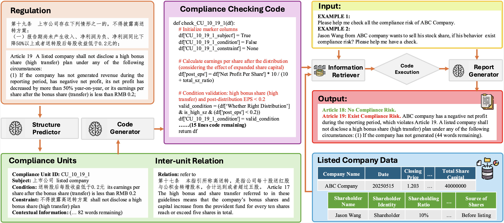

> Note: 
> 1. This repository is currently under construction. 
> 2. This repository is for academic purposes only. It does not represent the views of any organization, institution, or individual, and should not be considered legal or investment advice.

<p align="center">
  <h1 align="center">Compliance-to-Code: Enhancing Financial Compliance Checking via Code Generation</h1>
    <p align="center">
    <span class="author-block">
      Siyuan Li<sup>1,*</sup>,</span>
    <span class="author-block">
      Jian Chen<sup>1,*,†</sup>,</span>
    <span class="author-block">
      Rui Yao<sup>1</sup>,</span>
    <span class="author-block">
      Xuming Hu<sup>1</sup>,</span>
    <span class="author-block">
      Peilin Zhou<sup>1</sup>,</span>
    <span class="author-block">
      Weihua Qiu<sup>2</sup>,</span>
    <span class="author-block">
      Simin Zhang<sup>1</sup>,</span>
    <span class="author-block">
      Chucheng Dong<sup>3</sup>,</span>
    <span class="author-block">
      Zhiyao Li<sup>1</sup>,</span>
    <span class="author-block">
      Qipeng Xie<sup>1</sup>,</span>
    <span class="author-block">
      Zixuan Yuan<sup>1,†</sup>
    </span>
    </div>
    <div class="is-size-5 publication-authors" style="margin-top: 10px;">
        <span class="author-block">
            <sup>1</sup>Hong Kong University of Science and Technology (Guangzhou)
        </span><br>
        <span class="author-block">
            <sup>2</sup>Sun Yat-Sen University
        </span><br>
        <span class="author-block">
            <sup>3</sup>University of California, Riverside
        </span>
        <br>
        <span class="author-block">
            <sup>*</sup>Co-first authors, <sup>†</sup>Corresponding author
        </span>
        <br>
        <span class="author-block">
            {sli974, jchen524, ryao663, pzhou460, szhang420, zli632}@connect.hkust-gz.edu.cn,
            qiuwh9@mail2.sysu.edu.cn, cdong040@ucr.edu, qxieaf@connect.ust.hk,
            {xuminghu, zixuanyuan}@hkust-gz.edu.cn
        </span>
    </div>
  </p>
  <p align="center">
  📖<a href="https://arxiv.org/abs/2505.19804">Paper</a> | 🏠<a href="https://github.com/AlexJJJChen/Compliance-to-Code">Homepage</a> | 🤗<a href="https://huggingface.co/datasets/GPS-Lab/Compliance-to-Code">Huggingface Dataset</a>
  </p>
<div align="center"></div>
<p align="center">

Regulatory compliance is crucial for corporate governance, but financial regulations are often intricate and challenging to interpret. While Large Language Models (LLMs) show promise in automating the conversion of regulatory text to compliance logic, they face limitations with Chinese financial regulations, including incomplete domain knowledge and insufficient reasoning. To address this, we introduce **Compliance-to-Code**, the first large-scale Chinese dataset for financial regulatory compliance. It contains 1,159 annotated clauses from 361 regulations, structured into logical elements with Python code mappings and detailed reasoning. We also present **FinCheck**, a pipeline for regulation structuring, code generation, and report generation, demonstrating the dataset's utility.

## 📢 News
- 🚀 [26/05/2025] We released our [paper](https://arxiv.org/abs/2505.19804) on arxiv.
- 🚀 [15/05/2025] We released the **Compliance-to-Code** dataset and the **FinCheck** pipeline, the first large-scale Chinese resource for code-based financial compliance automation.

## 💡 Highlights
- 🔥 **Dataset:** We propose **Compliance-to-Code**, the first large-scale Chinese financial regulation dataset tailored for code-based compliance reasoning. It includes 1,159 annotated clauses from 361 regulations across ten categories, with 307 Python modules and detailed reasoning steps.
- 🔥 **FinCheck Pipeline:** We develop **FinCheck**, an end-to-end pipeline that leverages the Compliance-to-Code dataset for automated compliance checking. It includes modules for regulation structuring, code generation.
- 🔥 **Key Insights:** We conduct a comprehensive evaluation of recent LLMs for regulation structuring and code generation tasks. Our experiments show that Qwen3-8B achieves strong performance, and Supervised Fine-Tuning (SFT) significantly improves regulation structuring capabilities.

## 📕 Data Distribution
The **Compliance-to-Code** dataset is constructed from 361 authoritative Chinese financial regulations, primarily from the Beijing Stock Exchange (BSE), covering ten core thematic areas. It includes 1,159 annotated Compliance Units (CUs) and 307 executable compliance automation tasks in Python.

**Overall Statistics:**
-   **Regulations Analyzed:** 361
-   **Annotated Clauses (Compliance Units):** 1,159
-   **Inter-Unit Relations Annotated:** 864
-   **Executable Python Automation Tasks:** 307 (Simple: 70.03%, Medium: 11.07%, Difficult: 18.89%)
-   **Average COT Reasoning Steps per Task:** 8
-   **Average Tokens per COT Reasoning Step:** 2145

**Regulatory Domains Covered:**

| Domain/Aspect                        | Compliance Control Focus and Risk                                                    | # Source clauses | # Compliance Units | # Document Words |
| ------------------------------------ | ------------------------------------------------------------------------------------ | ---------------- | ------------------ | ---------------- |
| Independent Director Systems         | Independence requirements, director nomination/integrity review, conflict management.    | 30               | 126                | 5446             |
| Quarterly Reporting Obligations      | Timeliness, content sufficiency, disclosure controls for periodic reports.             | 16               | 32                 | 1888             |
| Equity Incentives and ESOPs          | Plan approval, risk limits, grantee eligibility, compliance disclosure events.         | 66               | 154                | 8132             |
| Share Repurchase Controls            | Buyback process, threshold triggers, ban periods, reporting duties.                    | 78               | 266                | 11458            |
| Tender Offer Compliance              | Takeover code triggers, procedural controls, reporting/approval checks.                | 36               | 113                | 4827             |
| Inside Information Management        | Insider identification, ad hoc event control points, information wall requirements.    | 25               | 48                 | 3564             |
| Board Transfer/Listing Change        | Conditions, procedural controls, risk disclosure for inter-market moves.               | 21               | 90                 | 2990             |
| Large Shareholder Transactions Control | Sale restriction, blackout periods, reporting triggers, conflict discipline.           | 29               | 107                | 5504             |
| Raised Fund Use Controls             | Escrow, use restriction, monitoring, board/supervisor review.                          | 27               | 117                | 4623             |
| Equity Rights Distribution           | Dividend/bonus triggers, shareholder fairness, process integrity.                      | 33               | 106                | 4908             |

## 📚 Example: The FinCheck Pipeline
The **FinCheck** pipeline demonstrates the practical application of the Compliance-to-Code dataset. It automates compliance checking by converting regulatory text into executable code.



**Pipeline Components:**
1.  **Structure Predictor:** Parses natural language regulations into structured Compliance Units (CUs) and their relations.
2.  **Code Generator:** Translates the structured CUs into executable Python compliance logic.
3.  **Information Retriever:** Fetches relevant company/client data for the compliance check.
4.  **Report Generator:** Summarizes the code execution outcome into a user-friendly compliance report.

## 🛠️ Usage

### Dataset Access
The **Compliance-to-Code** dataset is available on Huggingface Datasets and GitHub:
-   Huggingface: [https://huggingface.co/datasets/GPS-Lab/Compliance-to-Code](https://huggingface.co/datasets/GPS-Lab/Compliance-to-Code)
-   GitHub: [https://github.com/AlexJJJChen/Compliance-to-Code](https://github.com/AlexJJJChen/Compliance-to-Code)

The dataset is provided in JSON and CSV formats. Each entry contains:
-   Clean regulatory text.
-   Structured Compliance Units (CUs) with fields: `Subject`, `Condition`, `Constraint`, `Contextual Information`.
-   Annotated Inter-Unit Relations: `refer to`, `exclude`, `only include`, `should include`.
-   Python-coded compliance automation tasks.

### FinCheck Pipeline
The code for the FinCheck pipeline and experiments is available in the GitHub repository. The pipeline is designed for:
1.  **Regulation-to-Structure (R2S):** Parsing regulations into CUs.
2.  **Structure-to-Code (S2C):** Generating Python code from CUs.

Refer to the repository for details on setting up and running experiments.

## ✒️Results Highlights
We benchmarked various Large Language Models (LLMs) on regulation structuring and code generation tasks using the Compliance-to-Code dataset. Our experiments highlight that structured decomposition of regulations and explicit reasoning are crucial for effective compliance code generation, especially for complex scenarios. Please refer to our [paper](https://arxiv.org/abs/2505.19804) on arxiv for more details. 

## ✒️Citation
If you use the Compliance-to-Code dataset or the FinCheck pipeline in your research, please cite our paper:
```bibtex
@misc{li2025compliancetocodeenhancingfinancialcompliance,
      title={Compliance-to-Code: Enhancing Financial Compliance Checking via Code Generation}, 
      author={Siyuan Li and Jian Chen and Rui Yao and Xuming Hu and Peilin Zhou and Weihua Qiu and Simin Zhang and Chucheng Dong and Zhiyao Li and Qipeng Xie and Zixuan Yuan},
      year={2025},
      eprint={2505.19804},
      archivePrefix={arXiv},
      primaryClass={cs.CL},
      url={https://arxiv.org/abs/2505.19804}, 
}
```

## 📄 License
The Compliance-to-Code dataset,  the code for the FinCheck pipeline and associated tools are licensed under the **Creative Commons Attribution-NonCommercial 4.0 International (CC BY-NC 4.0) License**. Please refer to the `LICENSE` file in the GitHub repository and the Huggingface dataset card for more details.

The regulatory documents used to create this dataset were publicly published by the Beijing Stock Exchange (BSE).
